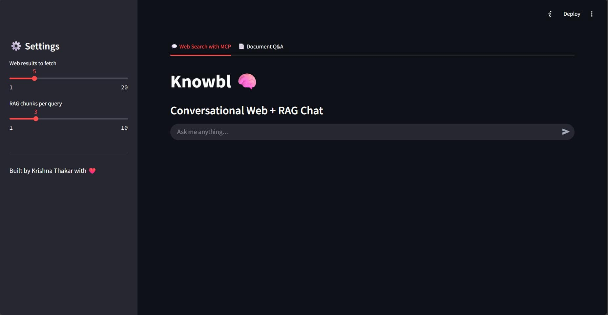

# 🧠 Knowbl – Web + Document RAG Assistant

📽️ **Click the image below to watch the project demo:**

<a href="https://www.youtube.com/watch?v=8OYBkonOg48">
  
</a>

Knowbl is an intelligent assistant that combines **real-time web search** with **RAG (Retrieval-Augmented Generation)**. It supports both live internet queries and document-based Q&A using LangChain, FAISS, and OpenAI (or local) embeddings, orchestrated via the **Model Context Protocol (MCP)** for modular agent interactions in a  Streamlit UI.

---

## 🚀 Features

- 🔍 **Conversational Web Search (MCP-enabled)**  
  Real-time search with Exa and Firecrawl APIs, followed by RAG-based semantic chunk retrieval.

- 📄 **Document Q&A**  
  Upload PDF or text files and ask contextual questions with references and summaries.

- 🧠 **Flexible Embeddings**  
  Choose from OpenAI, HuggingFace, or Ollama for chunk embedding.

- ⚡ **Local Vector Search**  
  Uses FAISS to store and retrieve relevant content with high speed.

- 🔌 **MCP Tool Integration**  
  Utilizes [FastMCP](https://github.com/agentic-ai/fastmcp) to expose search and retrieval tools via an extendable multi-component protocol.

---

## 🛠️ Setup

### 1. Clone & Install

```bash
git clone https://github.com/krsnathkr/rag-mcp-AgenticAI.git
cd rag-mcp-AgenticAI
pip install -r requirements.txt
````

### 2. Configure Environment Variables

Create a `.env` file in the root directory:

```env
EXA_API_KEY=XXXX
OPENAI_API_KEY=XXXX
OPENAI_API_BASE=https://api.openai.com/v1
MODEL=text-embedding-ada-002
```

---

## 🔑 How to Get Your API Keys

### 🧠 OpenAI

* Visit [https://platform.openai.com/account/api-keys](https://platform.openai.com/account/api-keys)
* Generate a new API key
* Paste it into `.env` as `OPENAI_API_KEY`

### 🌐 Exa (for web search)

* Go to [https://exa.ai](https://exa.ai)
* Create an account
* Navigate to "API Keys" in your dashboard
* Copy your key and add it to `.env` as `EXA_API_KEY`

---

## 🧩 Project Structure

```
├── main.py           # Streamlit frontend for web + document Q&A
├── mcp_server.py     # MCP integration for web search tools
├── rag.py            # RAG pipeline (chunking, embeddings, FAISS)
├── search.py         # Web search via Exa + HTML scraping
├── .env              # Environment variables (not checked into git)
```

---

## 🖥️ How to Run

### ▶️ Start the Streamlit App

```bash
streamlit run main.py
```

### 🌐 Run the MCP Server (tool integration)

```bash
python mcp_server.py
```

Once the app launches, you can:

* Chat with it via live web search (Tab 1)
* Upload a document and ask questions (Tab 2)

---

## ⚙️ Configuration

* Adjust chunk size and overlap in `rag.py`
* Change the embedding model (OpenAI, HuggingFace, Ollama)
* Tweak sidebar sliders for:

  * Number of search results (`num_results`)
  * Number of RAG chunks (`rag_k`)

---

## 🙌 Built With

* [LangChain](https://github.com/langchain-ai/langchain)
* [Streamlit](https://streamlit.io/)
* [OpenAI](https://openai.com/)
* [FAISS](https://github.com/facebookresearch/faiss)
* [Exa](https://exa.ai/)

---

## 📄 License

MIT License

```

Let me know if you want:
- GitHub badges (Stars, Forks, License),
- Screenshot section,
- Deployment tips (like Streamlit sharing or Docker),
- or API usage examples.
```
